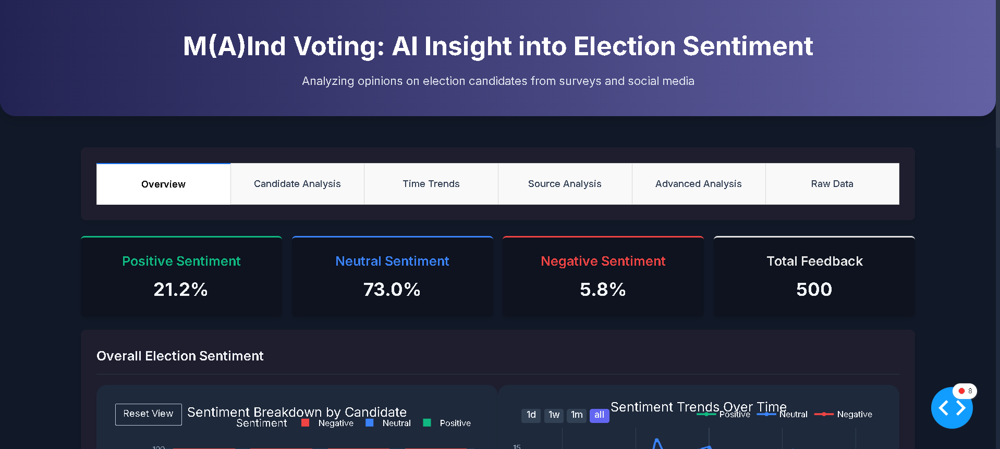
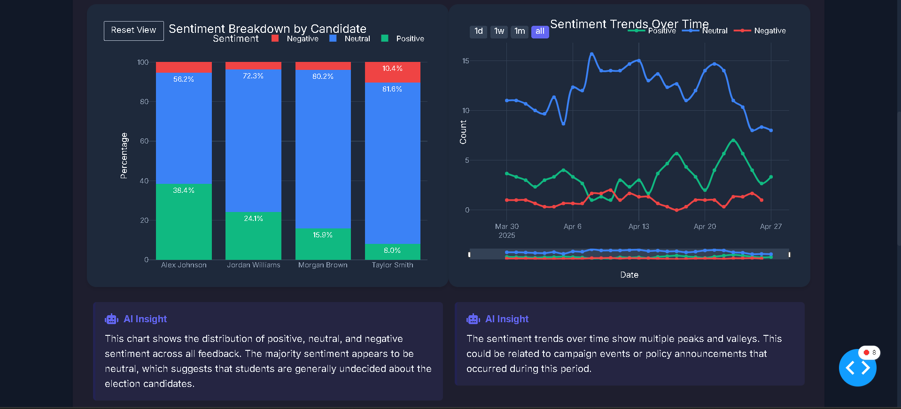
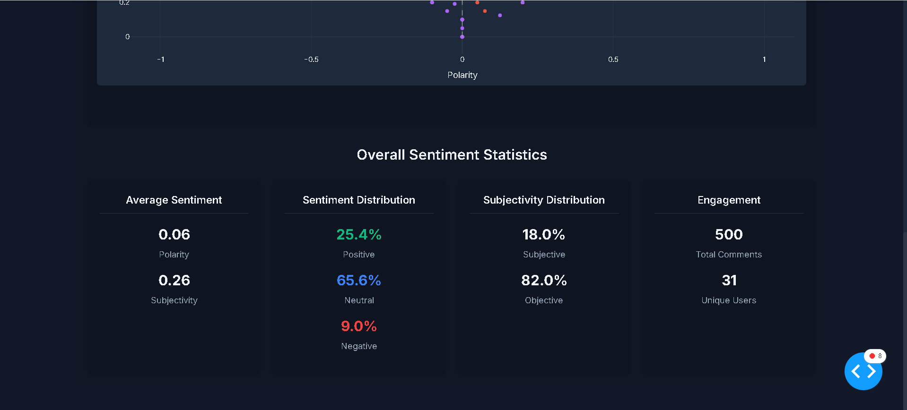
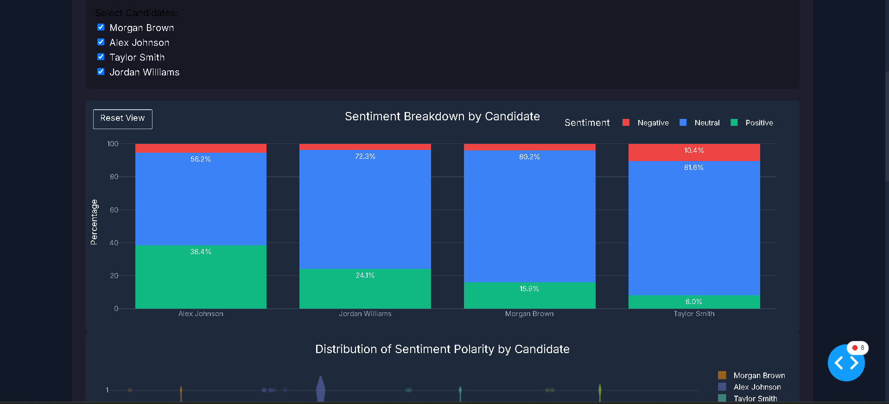
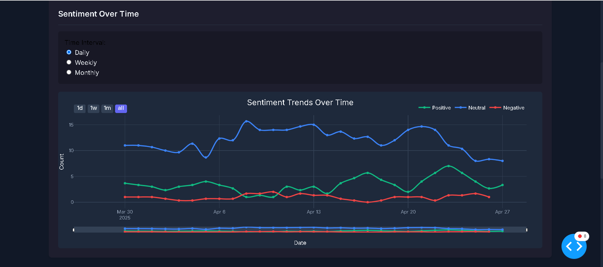
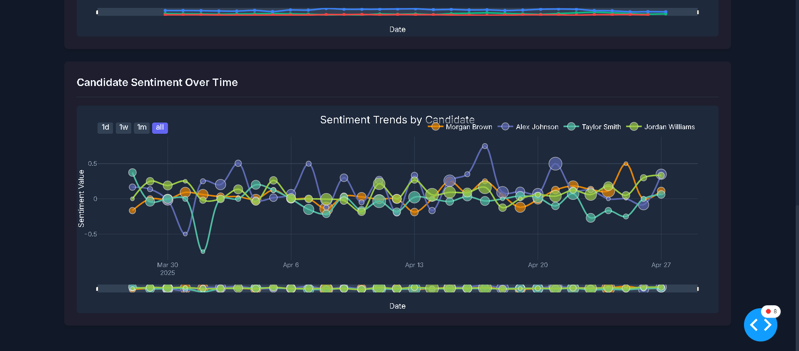
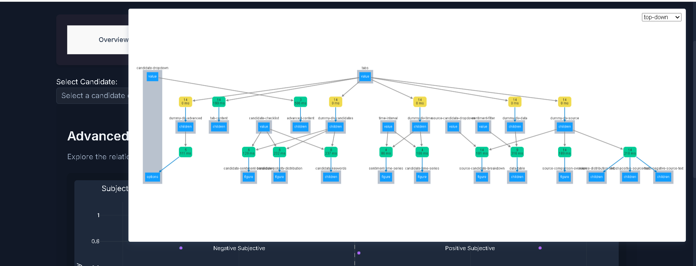

# MindThePolls: AI-Powered Election Sentiment Analysis

A comprehensive tool that analyzes student opinions on election candidates through advanced sentiment analysis and visualization techniques. MindThePolls provides data-driven insights into student sentiment trends, helping educational institutions better understand voter preferences and concerns.



## Table of Contents
- [Screenshots](#screenshots)
- [What MindThePolls Does](#what-mindthepolls-does)
- [Full Technology Stack](#full-technology-stack)
- [Features and Capabilities](#features-and-capabilities)
- [Where the Data Comes From](#where-the-data-comes-from)
- [Dashboard Sections](#dashboard-sections)
- [Recent Enhancements and Fixes](#recent-enhancements-and-fixes)
- [Setup and Installation](#setup-and-installation)
- [Data Import Guide](#data-import-guide)
- [Development and Customization](#development-and-customization)
- [Data Privacy and Security](#data-privacy-and-security)
- [Future Enhancements](#future-enhancements)
- [Contributors and Acknowledgments](#contributors-and-acknowledgments)
- [License](#license)

## Screenshots

### Dashboard Overview

*The main dashboard provides an intuitive, modern dark-themed interface with tab-based navigation and interactive visualizations.*

### Sentiment Analysis
<div align="center">
  
  
</div>

*Left: Pie chart showing distribution of positive, neutral, and negative sentiment across all feedback.  
Right: Summary statistics for the entire dataset including sample sizes and averages.*

### Candidate Analysis

*The candidate comparison shows sentiment breakdown by candidate with stacked bars indicating the proportion of positive, neutral, and negative feedback.*

### Time-Based Analysis
<div align="center">
  
  
</div>

*Left: Time series visualization showing how sentiment evolves throughout the election period.  
Right: Candidate-specific sentiment trends allowing for direct comparison of popularity over time.*

### Application Architecture

*Behind the scenes: The application's reactive callback structure that enables dynamic, responsive visualizations.*

## What MindThePolls Does

MindThePolls transforms raw student feedback into actionable insights through:

- **Automated Sentiment Analysis**: Leverages natural language processing to classify opinions as positive, neutral, or negative
- **Interactive Visualizations**: Provides clear, insightful visualizations that reveal patterns and trends
- **Multi-dimensional Analysis**: Examines sentiment across candidates, time periods, data sources, and key topics
- **AI-Generated Insights**: Delivers contextual explanations of visualization findings
- **Comprehensive Dashboard**: Organizes findings in an intuitive, modern interface

## Full Technology Stack

### Frontend
- **Dash** (v2.9.1): Python framework for building reactive web applications
- **Plotly.js** (v5.14.0): Interactive visualization library
- **HTML/CSS**: Custom styling with responsive design principles
- **Font Awesome**: Icons for enhanced user experience
- **Google Fonts (Inter)**: Typography for readability and aesthetics

### Backend
- **Python** (v3.9+): Core programming language
- **Flask** (v2.0.1): Web server that powers Dash
- **Pandas** (v1.5.0): Data manipulation and analysis
- **NumPy** (v1.23.0): Numerical computations for data processing
- **TextBlob** (v0.17.1): Natural language processing for sentiment analysis
- **NLTK** (v3.8.1): Natural Language Toolkit for text processing
- **scikit-learn** (v1.2.0): Machine learning functionality for advanced analysis

### Data Storage & Processing
- **CSV**: Primary data import/export format
- **Pandas DataFrames**: In-memory data storage and manipulation
- **Global Store Pattern**: Application state management

### Visualization
- **Plotly Express**: High-level interface for data visualization
- **Plotly Graph Objects**: Low-level customization of visualizations
- **Custom Visualization Module**: Reusable chart components with consistent styling

## Features and Capabilities

### Data Analysis
- **Sentiment Classification**: Analyzes text to determine positive, neutral, or negative sentiment
- **Polarity Scoring**: Numerical representation of sentiment (-1 to +1)
- **Subjectivity Analysis**: Measures how subjective or objective each opinion is
- **Keyword Extraction**: Identifies key topics and themes in feedback
- **Time-series Analysis**: Tracks sentiment changes over configurable time periods

### Visualization Components
- **Sentiment Breakdown Charts**: Distribution of sentiment by candidate or source
- **Time Series Visualizations**: Sentiment trends over customizable intervals
- **Polarity Distribution**: Violin plots showing polarity distribution patterns
- **Keyword Charts**: Frequency analysis of important terms
- **Sunburst Charts**: Hierarchical visualization of data relationships
- **Scatter Plots**: Subjectivity vs. polarity analysis

### Interactive UI
- **Responsive Design**: Adapts to different screen sizes
- **Dark Mode**: Reduces eye strain during extended analysis sessions
- **Tab-based Navigation**: Organizes insights by analysis type
- **Dynamic Filtering**: Real-time data filtering based on user selections
- **Interactive Controls**: Dropdowns, checklists, and radio buttons for customization
- **Hover Details**: Rich tooltips providing additional context
- **AI-generated Explanations**: Natural language descriptions of visualization insights

## Where the Data Comes From

MindThePolls can analyze student election sentiment from multiple sources:

### Supported Data Sources
1. **Student Surveys**: Structured feedback collected through institutional surveys
2. **Social Media**: Comments and posts from platforms like Twitter, Facebook, and Instagram
3. **Campus Forums**: Discussions from online student forums and discussion boards
4. **Direct Feedback**: Comments collected through suggestion boxes or email campaigns
5. **Focus Groups**: Transcribed discussions from student focus groups
6. **Campaign Events**: Feedback collected during candidate debates or presentations

### Data Import and Processing
- Users can import data via CSV files containing feedback text, candidate names, dates, and sources
- The application preprocesses text through tokenization, stopword removal, and normalization
- Sentiment analysis is performed using TextBlob's pattern analyzer
- Polarity scores are calculated and categorized as positive (>0.05), neutral (-0.05 to 0.05), or negative (<-0.05)
- Keywords are extracted using frequency analysis and importance scoring

### Sample Data
The repository includes `sample_election_feedback.csv` with synthetic data representing realistic student feedback. This allows users to explore the application's capabilities before importing their own data.

## Dashboard Sections

### Overview Tab
- **Overall Sentiment Distribution**: Pie chart showing positive, neutral, and negative proportions
- **Sentiment Over Time**: Line chart showing sentiment trends across the election period
- **Top Keywords**: Bar chart of most frequently mentioned terms
- **Summary Statistics**: Key metrics including sample size, average sentiment, and most discussed candidates

### Candidates Tab
- **Sentiment by Candidate**: Stacked bar chart comparing sentiment across candidates
- **Polarity Distribution**: Violin plots showing sentiment distribution patterns
- **Candidate Keywords**: Bar charts showing key terms associated with each candidate

### Time Analysis Tab
- **Sentiment Trends**: Interactive line charts showing sentiment evolution
- **Candidate Sentiment Over Time**: Comparative time series across candidates
- **Time Interval Selection**: Options for daily, weekly, or monthly aggregation

### Source Analysis Tab
- **Source Comparison Overview**: Sunburst chart showing sentiment distribution across sources
- **Source Breakdown by Candidate**: Stacked bar charts filtered by candidate
- **Source Analysis Insights**: Statistical breakdown of source distribution and sentiment metrics

### Advanced Analysis Tab
- **Subjectivity vs. Polarity**: Scatter plot showing relationship between these dimensions
- **Sentiment Statistics**: Detailed metrics including averages, distributions, and engagement
- **Candidate Selection**: Customizable analysis focused on specific candidates

### Data Tab
- **Raw Data Table**: Filterable table of all feedback with sentiment scores
- **Sentiment Filtering**: Options to focus on positive, neutral, or negative feedback
- **Visual Indicators**: Color-coded sentiment categorization

## Recent Enhancements and Fixes

The application has undergone significant improvements including:

1. **UI Enhancements**:
   - Improved typography using Inter font family for better readability
   - Enhanced color scheme with consistent semantic coloring
   - Responsive layouts for different screen sizes
   - Hover effects and animations for better interactivity

2. **Visualization Improvements**:
   - Fixed the sunburst chart in Source Comparison to properly display hierarchical data
   - Enhanced error handling in all visualizations to provide user-friendly feedback
   - Implemented consistent styling across all charts
   - Added AI-generated insights for data interpretation

3. **Error Handling and Stability**:
   - Added comprehensive error handling throughout the application
   - Implemented placeholder components to prevent layout shifts
   - Fixed callback issues in tab content rendering
   - Added graceful fallbacks for missing or invalid data

4. **Data Processing**:
   - Improved CSV import functionality
   - Enhanced keyword extraction logic
   - Optimized sentiment analysis performance
   - Added support for larger datasets

5. **New Features**:
   - Advanced tab with detailed sentiment statistics
   - Source comparison insights with statistical breakdowns
   - Time interval customization options
   - Enhanced filtering capabilities

## Setup and Installation

1. **Clone the repository**:
   ```
   git clone https://github.com/yourusername/mindthepolls.git
   cd mindthepolls
   ```

2. **Create a virtual environment** (recommended):
   ```
   python -m venv venv
   # On Windows:
   venv\Scripts\activate
   # On macOS/Linux:
   source venv/bin/activate
   ```

3. **Install required packages**:
   ```
   pip install -r requirements.txt
   ```

4. **Run the setup script** to download required NLTK data:
   ```
   python setup.py
   ```

5. **Start the application**:
   ```
   python app.py
   ```

6. **Access the dashboard** at http://127.0.0.1:8050/ in your web browser

## Data Import Guide

To analyze your own election feedback data:

1. **Prepare your CSV file** with the following columns:
   - `date`: Date of feedback (YYYY-MM-DD format)
   - `candidate`: Name of the election candidate
   - `feedback`: The actual text feedback or comment
   - `source`: Source of the feedback (e.g., "survey", "twitter", "forum")

2. **Import steps**:
   - Click the "Import Data" button in the application header
   - Use the file selector or drag-and-drop to upload your CSV
   - Confirm column mappings if prompted
   - Click "Process Data" to begin analysis

3. **Validation**:
   - The application will verify your data format
   - Any validation issues will be displayed with suggestions
   - Successfully imported data will immediately refresh the dashboard

## Development and Customization

### Project Structure
- `app.py`: Main application file with Dash layout and callbacks
- `visualization.py`: Module containing visualization functions
- `analysis.py`: Text processing and sentiment analysis functions
- `utils.py`: Utility functions for data handling
- `assets/`: CSS styles, images, and other static assets

### Customization Options
- Edit `app.py` to modify layout and callbacks
- Modify `visualization.py` to create new visualizations
- Adjust sentiment thresholds in `analysis.py`
- Update styles in `assets/styles.css`

## Data Privacy and Security

- MindThePolls runs entirely locally on your machine
- No data is sent to external servers
- All processing occurs within the application
- Imported data remains on your computer
- No user tracking or analytics

## Future Enhancements

Planned improvements include:

- Machine learning models for more accurate sentiment classification
- Emotion detection beyond basic sentiment analysis
- Topic modeling using LDA (Latent Dirichlet Allocation)
- Real-time social media integration
- Export capabilities for reports and presentations
- Comparative analysis across multiple elections

## Contributors and Acknowledgments

This project was developed to provide educational institutions with better insights into student election sentiment. Special thanks to the open-source community and the developers of the libraries that make this project possible.

## License

This project is licensed under the MIT License - see the LICENSE file for details. 